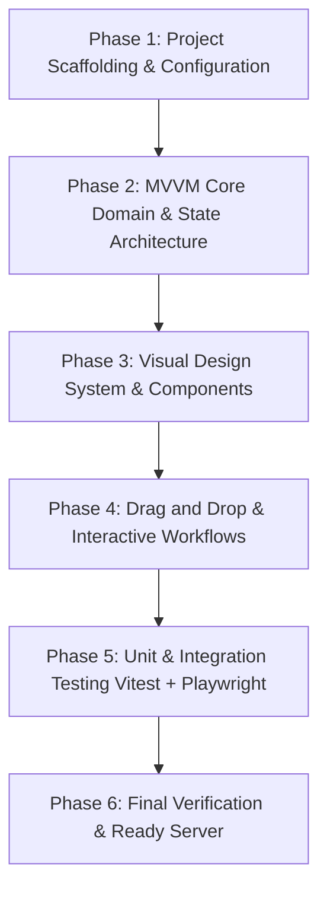

# Implementation Plan - Kanban Web Application MVP

An MVP Kanban project management web application built in the `frontend` subdirectory using a modern client-rendered NodeJS stack (Vite + React + TypeScript + Vanilla CSS), following strict MVVM architecture, clean SOLID design, and the exact specified color palette.

## Strategy & Phased Roadmap



---

## Phases & Success Criteria

### Phase 1: Scaffolding and Configuration
- [ ] Create `frontend` directory using Vite + React + TypeScript.
- [ ] Setup root and frontend `.gitignore` files.
- [ ] Configure Vitest and Playwright test environments.
- [ ] Setup base CSS architecture and color tokens matching design specifications.
- **Success Criteria**: `npm run build` succeeds, Vitest and Playwright runners execute cleanly.

### Phase 2: Domain Models & ViewModel Architecture (MVVM)
- [ ] Define immutable domain models: `Card`, `Column`, `Board`.
- [ ] Implement initial dummy dataset representing 5 default columns and sample cards.
- [ ] Implement `KanbanViewModel` (or React hook MVVM state layer) adhering to SOLID principles:
  - Add card to specific column (title and details).
  - Delete card by ID.
  - Move card between columns or reorder within column.
  - Rename column title.
- [ ] Write unit tests for all domain models and ViewModel actions.
- **Success Criteria**: 100% of domain and ViewModel unit tests pass in Vitest.

### Phase 3: Visual Design System & Component Hierarchy
- [ ] Implement CSS design tokens in `frontend/src/index.css`:
  - Accent Yellow: `#ecad0a`
  - Blue Primary: `#209dd7`
  - Purple Secondary: `#753991`
  - Dark Navy: `#032147`
  - Gray Text: `#888888`
  - Clean font pairing (Inter/Outfit via Google Fonts), glassmorphism column panels, sleek elevation shadows, micro-transitions.
- [ ] Create View components:
  - `Header`: Board title and status indicators.
  - `BoardView`: Responsive container for the 5 columns.
  - `ColumnView`: Editable column header, card list, add card trigger button.
  - `CardView`: Card title, details preview, delete action button, drag handle / draggable state.
  - `AddCardModal` / `CardFormView`: Modal / inline dialog with clean form controls to add card title and details.
- [ ] Ensure strict adherence to guidelines: **Zero emojis** across all components, labels, and text.
- **Success Criteria**: Visual hierarchy matches requirements with responsive layout and distinct styling.

### Phase 4: Drag & Drop Interactions & Dynamic Editing
- [ ] Implement drag-and-drop using HTML5 Drag and Drop API or `@hello-pangea/dnd` (accessible, smooth, reliable drag-and-drop).
- [ ] Implement inline column renaming with blur / Enter commit and Esc cancel.
- [ ] Implement card creation modal with keyboard navigation (Esc to close, Enter/submit button with `#753991` purple styling).
- [ ] Implement card deletion with confirmation.
- **Success Criteria**: Seamless drag-and-drop between all 5 columns with visual drop target feedback.

### Phase 5: Comprehensive Unit & Playwright Integration Testing
- [ ] Vitest unit tests:
  - ViewModel operations: adding, deleting, moving, renaming.
  - Component rendering and event bindings.
- [ ] Playwright E2E integration tests:
  - Loading board with 5 default columns and dummy cards.
  - Renaming a column and verifying UI state.
  - Adding a new card to a column.
  - Dragging and dropping a card from one column to another.
  - Deleting a card and verifying removal.
- **Success Criteria**: All unit and Playwright integration tests pass without errors or flaky timeouts.

### Phase 6: Server Readiness & Documentation
- [ ] Ensure frontend dev server runs reliably.
- [ ] Create minimal, concise `README.md` (strictly no emojis).
- **Success Criteria**: Dev server is active and accessible, full MVP requirements verified.

---

## User Review Required

> [!IMPORTANT]
> - **Technology Choice**: Vite + React + TypeScript with standard CSS variables is chosen for clean MVVM separation, type safety, Vitest unit testing, and Playwright integration testing.
> - **No Emojis Rule**: Enforced strictly across code, UI, tests, and documentation.
> - **Scope Guard**: Only the single board with 5 columns, add/delete card, rename column, and drag-and-drop. No search, no filter, no persistence, no user management.

---

## Proposed Changes

### Configuration & Scaffolding

#### [NEW] [`.gitignore`](file:///Users/vrav/Desktop/Project/AI%20Coder%20Practice/Kanban_antigravity/.gitignore)
- Ignore `node_modules`, `dist`, `.DS_Store`, and test artifacts.

#### [NEW] [`frontend/package.json`](file:///Users/vrav/Desktop/Project/AI%20Coder%20Practice/Kanban_antigravity/frontend/package.json)
- Scripts and dependencies for Vite, React, TypeScript, Vitest, Testing Library, Playwright, `@hello-pangea/dnd` / `lucide-react` (icons without emojis).

#### [NEW] [`frontend/vite.config.ts`](file:///Users/vrav/Desktop/Project/AI%20Coder%20Practice/Kanban_antigravity/frontend/vite.config.ts)
- Vite configuration with React plugin and test configuration.

#### [NEW] [`frontend/playwright.config.ts`](file:///Users/vrav/Desktop/Project/AI%20Coder%20Practice/Kanban_antigravity/frontend/playwright.config.ts)
- Playwright E2E configuration with webServer configuration.

---

### MVVM Architecture

#### [NEW] [`frontend/src/models/types.ts`](file:///Users/vrav/Desktop/Project/AI%20Coder%20Practice/Kanban_antigravity/frontend/src/models/types.ts)
- Interfaces for `Card`, `Column`, `Board`, and initial dummy data generator.

#### [NEW] [`frontend/src/viewmodels/useKanbanViewModel.ts`](file:///Users/vrav/Desktop/Project/AI%20Coder%20Practice/Kanban_antigravity/frontend/src/viewmodels/useKanbanViewModel.ts)
- ViewModel layer managing reactive board state, validation, actions (`addCard`, `deleteCard`, `moveCard`, `renameColumn`).

---

### Views & Components

#### [NEW] [`frontend/src/index.css`](file:///Users/vrav/Desktop/Project/AI%20Coder%20Practice/Kanban_antigravity/frontend/src/index.css)
- CSS custom properties (color tokens `#ecad0a`, `#209dd7`, `#753991`, `#032147`, `#888888`), typography, reset, grid/flex layouts, glassmorphism cards, drag animations.

#### [NEW] [`frontend/src/components/Header.tsx`](file:///Users/vrav/Desktop/Project/AI%20Coder%20Practice/Kanban_antigravity/frontend/src/components/Header.tsx)
- Top bar with board title, subtle accent bar, and column/card summary.

#### [NEW] [`frontend/src/components/BoardView.tsx`](file:///Users/vrav/Desktop/Project/AI%20Coder%20Practice/Kanban_antigravity/frontend/src/components/BoardView.tsx)
- 5-column horizontal scrollable board container with drag-and-drop context.

#### [NEW] [`frontend/src/components/ColumnView.tsx`](file:///Users/vrav/Desktop/Project/AI%20Coder%20Practice/Kanban_antigravity/frontend/src/components/ColumnView.tsx)
- Column container with editable title, card counter, card drop list, and "+ Add Card" action.

#### [NEW] [`frontend/src/components/CardView.tsx`](file:///Users/vrav/Desktop/Project/AI%20Coder%20Practice/Kanban_antigravity/frontend/src/components/CardView.tsx)
- Card component displaying title, details, and delete button with hover effect.

#### [NEW] [`frontend/src/components/AddCardModal.tsx`](file:///Users/vrav/Desktop/Project/AI%20Coder%20Practice/Kanban_antigravity/frontend/src/components/AddCardModal.tsx)
- Accessible modal dialog for creating a card with title and details.

---

### Testing

#### [NEW] [`frontend/src/viewmodels/__tests__/useKanbanViewModel.test.ts`](file:///Users/vrav/Desktop/Project/AI%20Coder%20Practice/Kanban_antigravity/frontend/src/viewmodels/__tests__/useKanbanViewModel.test.ts)
- Unit tests for column rename, card addition, card deletion, and cross-column reordering.

#### [NEW] [`frontend/e2e/kanban.spec.ts`](file:///Users/vrav/Desktop/Project/AI%20Coder%20Practice/Kanban_antigravity/frontend/e2e/kanban.spec.ts)
- Playwright E2E test verifying end-to-end user workflows in a real browser.

---

### Documentation

#### [NEW] [`README.md`](file:///Users/vrav/Desktop/Project/AI%20Coder%20Practice/Kanban_antigravity/README.md)
- Concise project overview, architecture details, and how to run dev and tests. No emojis.

---

## Verification Plan

### Automated Tests
1. **Unit Tests**:
   ```bash
   cd frontend && npm run test:unit
   ```
2. **Integration / E2E Tests**:
   ```bash
   cd frontend && npx playwright test
   ```
3. **Type Checking & Production Build**:
   ```bash
   cd frontend && npm run build
   ```

### Manual & Visual Verification
- Use the browser tool to interactively verify:
  - Initial load shows 5 columns populated with dummy cards.
  - Renaming column updates title immediately.
  - Adding a card opens modal and appends card with specified title and details.
  - Dragging card between columns smoothly updates placement.
  - Deleting card removes it cleanly from the column.
  - UI colors match the exact specifications.
